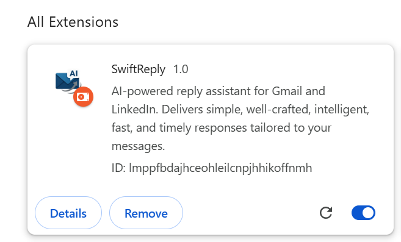
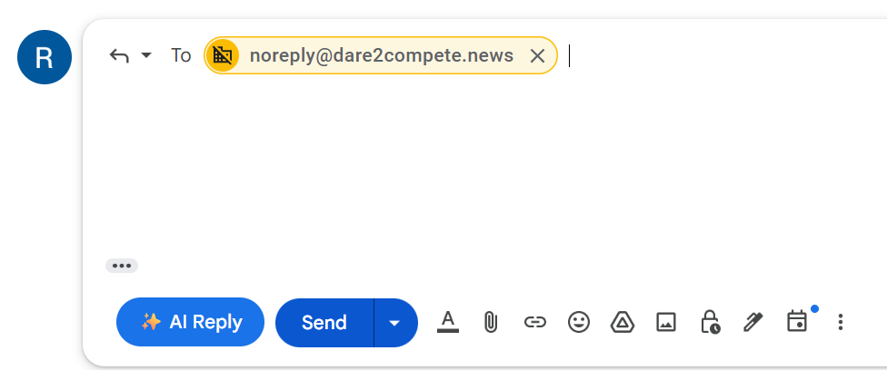
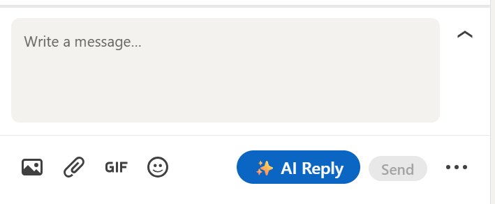
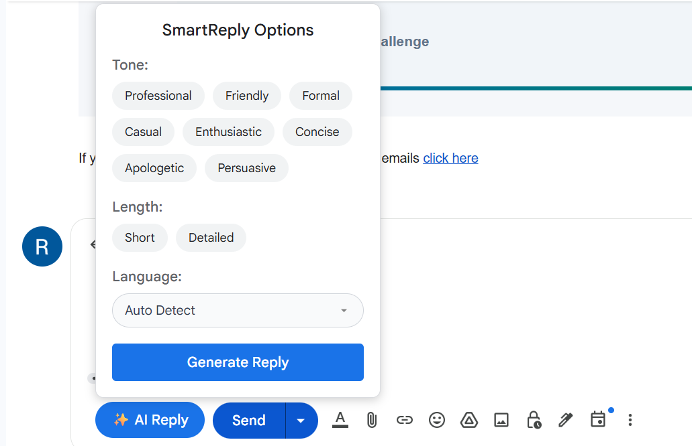
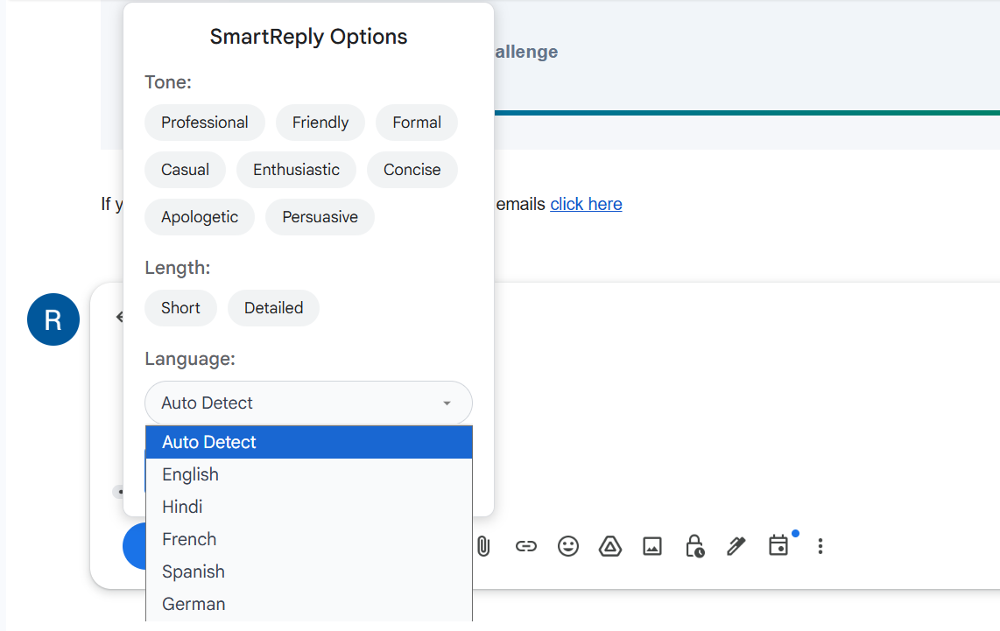
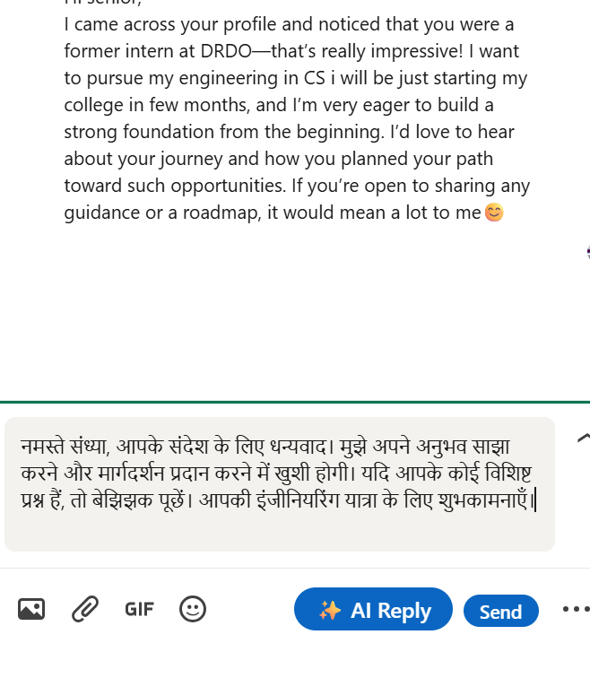

## SwiftReply – AI-Powered Smart Reply Chrome Extension


### Overview
**SwiftReply** is an AI-powered Chrome extension for **Gmail** and **LinkedIn** that generates **context-aware replies** with customizable tones and lengths and multi-language support.  

The name **SWIFT** represents the project’s philosophy:  
- **S** – Simple  
- **W** – Well-crafted  
- **I** – Intelligent  
- **F** – Fast  
- **T** – Timely  

With seamless integration into Gmail and LinkedIn, SwiftReply boosts productivity by eliminating repetitive typing and generating instant responses using the **Gemini API**.

### Core Features
- **Custom 'AI Reply' Button** – Injected directly into Gmail and LinkedIn UI.  
- **Tone & Style Selector** – Choose from Professional, Casual, Friendly, Enthusiastic, Formal, Concise, Apologetic, or Persuasive.  
- **Reply Length Options** – Generate short or detailed responses.  
- **Multi-Language Support** – English, Hindi, French, Spanish, German, or auto-detect based on message language.  
- **Real-Time AI Responses** – Captures message context and generates smart replies via a **Spring Boot backend** using Gemini API.  
- **Seamless Integration** – Works without disrupting Gmail or LinkedIn’s native UI.

### Setup & Configuration

#### Backend (Spring Boot)
1. Clone the repository:
   ```bash
   git clone https://github.com/ravishaa2005/SwiftReply-Chrome-extension.git
   cd SwiftReply/backend

2. Run the backend server:
   ```bash
   ./mvnw spring-boot:run

3. Configure Gemini API key in application.properties:
   gemini.api.key=api_key_here

### Extension Screenshots

| Extension in Chrome | Gmail Integration | LinkedIn Integration |
|----------------------|------------------|----------------------|
|  |  |  |

| Selector Pop-up (Tone + Length) | Selector Pop-up (Language) | Generated Reply Example |
|---------------------------------|----------------------------|-------------------------|
|  |  |  |


